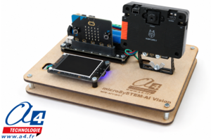

# a4-microsystem-ai-vision



MakeCode extension for the **A4 Technologie microSySTEM-AI Vision** educational artificial-intelligence model for **BBC micro:bit**.

The model combines a HuskyLens 2 camera, a programmable color LCD and the RGB LEDs of a DFR1216 controller. It enables students to create embedded visual-recognition applications and exchange the recognized information with other microSySTEM models by radio.

## Product and educational use

The microSySTEM-AI Vision model can be used to study:

- image classification by supervised learning;
- object, color, face, tag and line recognition with HuskyLens 2;
- acquisition and processing of a visual identifier;
- visual feedback with RGB LEDs and a color LCD;
- radio communication between two BBC micro:bit systems;
- automated sorting, access control, product recognition and inspection scenarios.

**Product:** microSySTEM-AI Vision

**Reference:** `MIS-AIV-K01`

**Dimensions:** 200 × 200 × 90 mm

Product page:

https://www.a4.fr/ai-vision-maquette-programmable-microsystem-pour-micro-bit.html

Manufacturer:

https://www.a4.fr

## Hardware and dependencies

The extension automatically installs:

- `huskylens2` — the DFRobot HuskyLens 2 MakeCode extension;
- `lcdDisplay` — the A4 UART-compatible fork of the DFRobot color LCD extension.

The **a4 microSySTEM AI Vision** menu contains the A4-specific helpers for the DFR1216 controller and LCD initialization. Camera and display blocks remain available in their own MakeCode menus.

| Component | Connection or interface |
|---|---|
| HuskyLens 2 camera | I2C |
| DFR1216 controller and RGB LEDs | I2C address `0x33` |
| DFRobot color LCD R pin | micro:bit TX P1 |
| DFRobot color LCD T pin | micro:bit RX P0 |

UART wiring is crossed: controller **TX** connects to display **R**, and controller **RX** connects to display **T**. Set the display selector to UART/Serial mode before starting the program.

## Add the extension in MakeCode

1. Open [MakeCode for micro:bit](https://makecode.microbit.org/).
2. Create or open a project.
3. Select **Extensions**.
4. Paste the repository URL into the search field:

```text
https://github.com/A4-TECHNOLOGIE/microSySTEM-AI-Vision
```

5. Select **a4 microSySTEM AI Vision**.

## First use

Initialize each interface once in the **on start** section:

```typescript
a4MicroSystemAiVision.initLcdUart(SerialPin.P1, SerialPin.P0)
lcdDisplay.lcdClearAll()
lcdDisplay.lcdSetBgcolor(0xffffff)

huskylens2.I2CInit()
huskylens2.switchAlgorithm(
    huskylens2.Algorithm.AlgorithmSelfLearningClassification
)
```

Avoid placing the LCD or camera initialization in a `forever` loop.

## Blocks / API

### Read the battery level

```typescript
let level = a4MicroSystemAiVision.batteryLevel()
```

Returns the battery level reported by the DFR1216 controller in percent. [Detailed help](docs/battery-level.md)

### Set predefined RGB colors

```typescript
a4MicroSystemAiVision.setDualRgbColors(
    A4VisionRgbColor.Green,
    A4VisionRgbColor.Green
)
```

Sets RGB0 and RGB1 simultaneously. [Detailed help](docs/set-dual-rgb-colors.md)

### Set numeric RGB values

```typescript
a4MicroSystemAiVision.setDualRgb(255, 0, 0, 0, 0, 255)
```

Sets each RGB component from 0 to 255. Values outside this range are limited automatically. [Detailed help](docs/set-dual-rgb.md)

### Set RGB brightness

```typescript
a4MicroSystemAiVision.setRgbBrightness(64)
```

Changes the common brightness of both RGB LEDs. [Detailed help](docs/set-rgb-brightness.md)

### Turn off the RGB LEDs

```typescript
a4MicroSystemAiVision.clearRgb()
```

Turns off RGB0 and RGB1. [Detailed help](docs/clear-rgb.md)

### Initialize the color LCD over UART

```typescript
a4MicroSystemAiVision.initLcdUart(SerialPin.P1, SerialPin.P0)
```

Initializes the serial link at 9600 baud using the default model wiring. [Detailed help](docs/initialize-lcd-uart.md)

## Example: display a learned classification

The following example reads a class learned with HuskyLens 2 and displays its identifier. The four objects must first be learned in the camera as IDs 1 to 4.

```typescript
a4MicroSystemAiVision.initLcdUart(SerialPin.P1, SerialPin.P0)
lcdDisplay.lcdClearAll()
lcdDisplay.lcdSetBgcolor(0xffffff)

huskylens2.I2CInit()
huskylens2.switchAlgorithm(
    huskylens2.Algorithm.AlgorithmSelfLearningClassification
)

basic.forever(function () {
    huskylens2.getResultSelfLearningClassification()

    if (huskylens2.availableSelfLearningClassification()) {
        let learnedId = huskylens2.cachedSelfLearningClassificationResult(
            huskylens2.SelfLearningClassificationProperty.Id
        )

        lcdDisplay.lcdDisplayText(
            "ID : " + learnedId,
            1,
            110,
            110,
            lcdDisplay.FontSize.Large,
            0x000000
        )
    }

    basic.pause(100)
})
```

## LCD widget deletion correction

The A4 LCD UART dependency converts each MakeCode widget category to the command identifier required by the display protocol. This correction allows calls such as the following to delete text objects correctly:

```typescript
lcdDisplay.lcdDeleteWidget(
    lcdDisplay.getLCDWidgetCategoryTwo(LCDWidgetCategoryTwo.Text),
    3
)
```

The function signature and block identifiers are unchanged, so projects created with the earlier development version remain compatible.

## Backward compatibility

New blocks generate the MakeCode-compliant namespace `a4MicroSystemAiVision`. The previous development namespace `a4_ai_vision` remains available as a hidden TypeScript compatibility layer. Existing projects therefore continue to compile, while new projects use the standardized API.

## Testing and validation

The root [`test.ts`](test.ts) file provides compilation coverage for the complete public API, the LCD deletion call and the HuskyLens 2 dependency without attempting to access physical hardware in the simulator.

The required hardware procedures, expected results and pass/fail criteria are documented in [`TESTING.md`](TESTING.md).

Ready-to-use programs are available in the [`examples`](examples) folder for the battery/RGB test and the LCD text-deletion regression test.

## Français

Cette extension MakeCode permet de programmer la maquette pédagogique **microSySTEM-AI Vision** d'A4 Technologie.

Elle installe automatiquement les extensions de la caméra HuskyLens 2 et de l'écran LCD couleur. Le menu **a4 microSySTEM AI Vision** ajoute les fonctions propres à la carte DFR1216 : lecture du niveau de batterie, commande simultanée des deux LED RGB et initialisation de l'écran en UART.

Les blocs peuvent être utilisés pour réaliser des activités de classification d'images, de tri automatisé, de contrôle visuel ou de reconnaissance de produits. La maquette peut transmettre par radio l'identifiant reconnu à une autre maquette microSySTEM, par exemple Weight, Parking ou Barrier.

- [Page produit microSySTEM-AI Vision](https://www.a4.fr/ai-vision-maquette-programmable-microsystem-pour-micro-bit.html)
- [Site A4 Technologie](https://www.a4.fr)

## License

This extension is released under the **MIT License**. See [LICENSE.txt](LICENSE.txt).

## A4 Technologie

Designed for educational use by A4 Technologie.

https://www.a4.fr

---

for PXT/microbit
